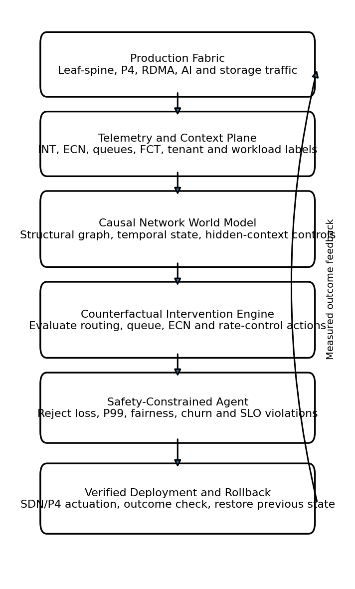

# Architecture

CausalNetTwin separates observation, inference, decision, deployment, and verification so that no model can directly change the production fabric.

1. **Telemetry plane:** P4 INT, switch counters, ECN marks, queue occupancy, flow completion time, packet loss, Kubernetes workload labels, storage I/O pressure, and AI collective phase.
2. **Causal world model:** A structural model represents direct and mediated effects among workload mix, routing, queue state, rate control, loss, fairness, and tail latency.
3. **Counterfactual engine:** Candidate actions are evaluated under `do(action)` interventions rather than by conditioning only on historical correlations.
4. **Safety gate:** The action is rejected if any predicted invariant is exceeded.
5. **Deployment controller:** Approved actions are translated to SDN, P4Runtime, queue, routing, or rate-control changes.
6. **Verification and rollback:** The controller compares observed and predicted outcomes over a bounded window. Material harmful deviation restores the previous configuration.

